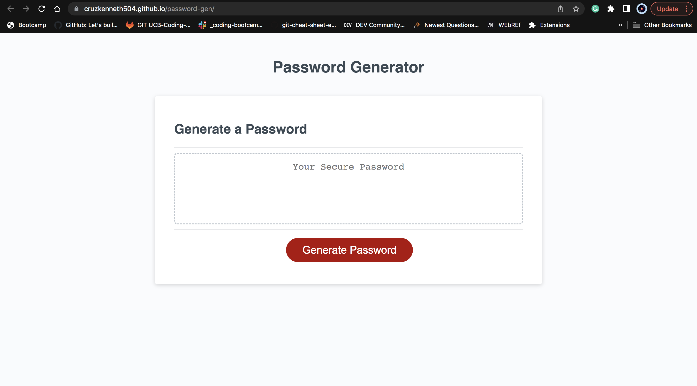

# **Password Generator**

## **Overview**

This project is a password generator written in JavaScript. It asks the user how long they want their password to be and which types of characters they want to include (like uppercase letters, lowercase letters, numbers, and special symbols). Then, it creates a password based on those preferences and shows it to the user. It's a helpful tool for making strong passwords quickly and easily

## **Features**

- Allows the user to choose the length of the password (between 8 and 128 characters).
- Enables selection of character types to include in the password: uppercase letters, lowercase letters, numbers, and special characters.
- Validates user input to ensure a valid password can be generated.
- Generates a random password based on the user's preferences.
- Provides the generated password to the user for immediate use.

## Usage

To use the password generator:

1. Open the [Password Generator](https://cruzkenneth504.github.io/password-gen/) in a web browser.
2. Click the "Generate Password" button.
3. Follow the prompts to specify the length of the password and select character types.
4. Once completed, the generated password will be displayed on the page.

## **Technology Used**

| Technology Used |                                                    Resource URL                                                    |
| --------------- | :----------------------------------------------------------------------------------------------------------------: |
| HTML            |       [https://developer.mozilla.org/en-US/docs/Web/HTML](https://developer.mozilla.org/en-US/docs/Web/HTML)       |
| CSS             |        [https://developer.mozilla.org/en-US/docs/Web/CSS](https://developer.mozilla.org/en-US/docs/Web/CSS)        |
| Git             |                                    [https://git-scm.com/](https://git-scm.com/)                                    |
| Js              | [https://developer.mozilla.org/en-US/docs/Web/JavaScript](https://developer.mozilla.org/en-US/docs/Web/JavaScript) |

## **Prerequisites**

**Install or open the internet browser of your choice.**

- **Examples Below:**

* Google Chrome
* Safari
* OPera
* Mozilla Firefox
* Internet Explorer

### **Installing**

**Click the link below:**

[Link to password generator website](https://cruzkenneth504.github.io/password-gen/)

## **Built With**

- [HTML Dev](https://developer.mozilla.org/en-US/docs/Web/HTML)
- [HTML W3](https://www.w3schools.com/html/default.asp)
- [CSS Dev](https://developer.mozilla.org/en-US/docs/Web/CSS)
- [CSS W3](https://www.w3schools.com/css/default.asp)
- [JS Dev](https://cruzkenneth504.github.io/password-gen/)
- [Js W3](https://www.w3schools.com/js/)

## **Visual**

## **Author**

**Kenneth Cruz**

* [Link to Password Generator Repo](https://github.com/Cruzkenneth504/password-gen)
* [Link to Password Generator Site](https://cruzkenneth504.github.io/password-gen/)
* [Link to Github](https://github.com/cruzkenneth504)
* [Link to LinkedIn](linkedin.com/in/cruzkenneth504)

## **Acknowledgments**

- [UCB BootCamp](https://bootcamp.berkeley.edu/)
- [DevTools](https://dev.to/)
- [Youtube](https://www.youtube.com/)

## License
This project is licensed under the MIT License - see the [LICENSE](LICENSE) file for details.
